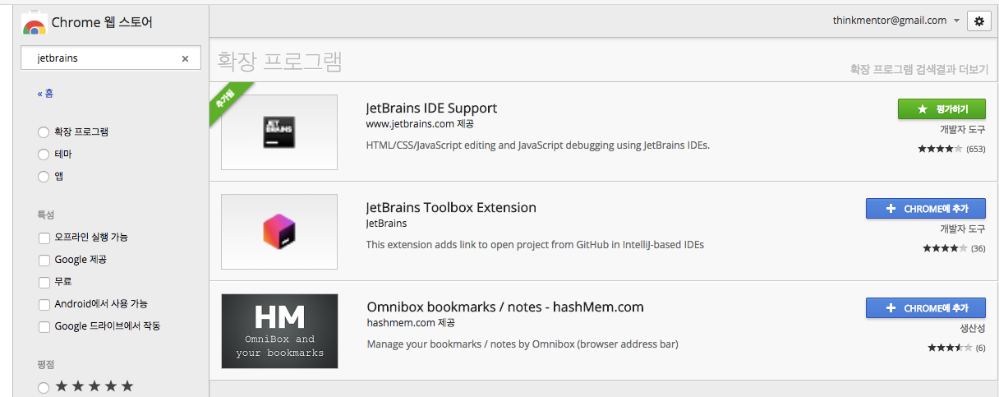
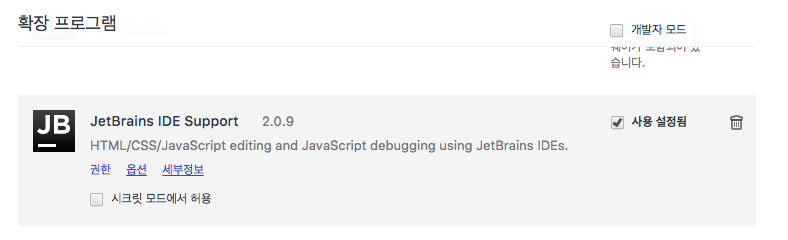
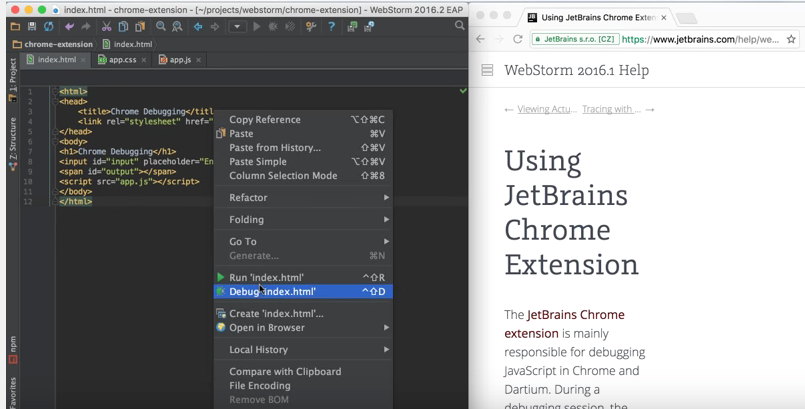
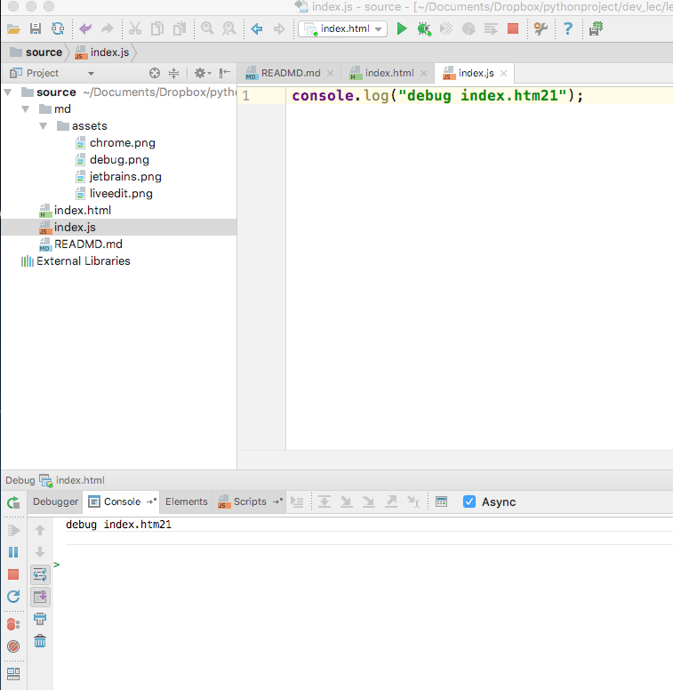

## Git 
…or create a new repository on the command line
~~~
git init
git add README.md
git commit -m "first commit"
git remote add origin git@github.com:lux600/lec_modern_responsive.git
git push -u origin master
~~~

## introduce 

- sample site 
    - http://www.idynxschool.com/vesco/
    
## Tools 
1. [Chrome](https://www.google.com/chrome/browser/desktop/index.html) 
2. [Window Resizer](https://chrome.google.com/webstore/detail/window-resizer/kkelicaakdanhinjdeammmilcgefonfh/related?hl=en) 
3. [Page Ruler](https://chrome.google.com/webstore/detail/page-ruler/jlpkojjdgbllmedoapgfodplfhcbnbpn)
4. [Instant Wireframe](https://chrome.google.com/webstore/detail/instant-wireframe/pmpmnmbgidlnoamkpmcikaejhmeldnha)
5. [ColorZilla](https://chrome.google.com/webstore/detail/colorzilla/bhlhnicpbhignbdhedgjhgdocnmhomnp/related)
6. [DevTools Autosave](https://chrome.google.com/webstore/detail/devtools-autosave/mlejngncgiocofkcbnnpaieapabmanfl)
7. [Image Downloader](https://chrome.google.com/webstore/detail/image-downloader/cnpniohnfphhjihaiiggeabnkjhpaldj)
8. [Stylebot](https://chrome.google.com/webstore/detail/stylebot/oiaejidbmkiecgbjeifoejpgmdaleoha)

## Live Edit
1. Chrome 
    - 확장 프로그램 jetrains
    

2. 확장프로그램 > 플러그인 사용 

3. Pycharm > Preferences > Plugins > liveedit

4. Pycharm 편집모드에서 오른쪽 마우스 
    - Debug 를 누르면 새로운 브라우저가 뜨면서 연동 

5. 아래에 console 도 같이 보임 

## Chrome 
- 브라우저 오른쪽 마우스 > 검사 
    - 스마트폰 사이즈로 보기 
    - Edit > 추가하고 싶은 Device 입력          

## Wire Framework
- balsamiq
- 
