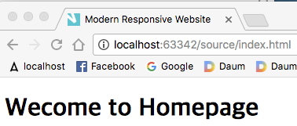
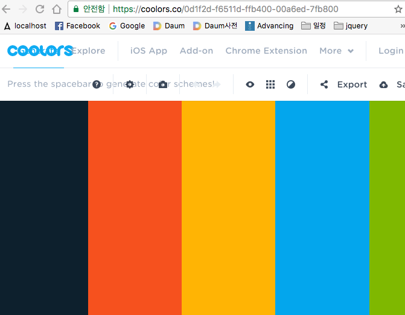
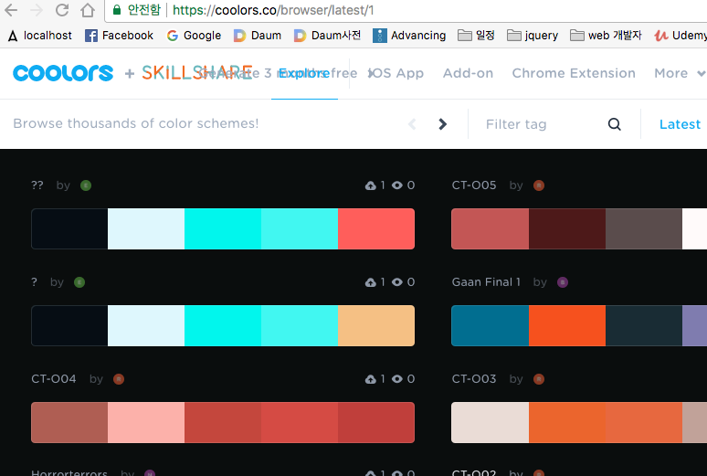
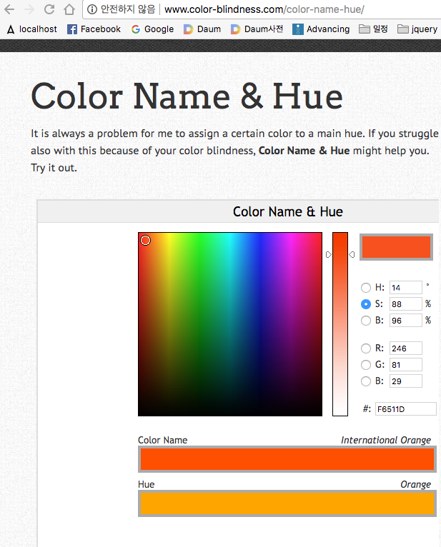
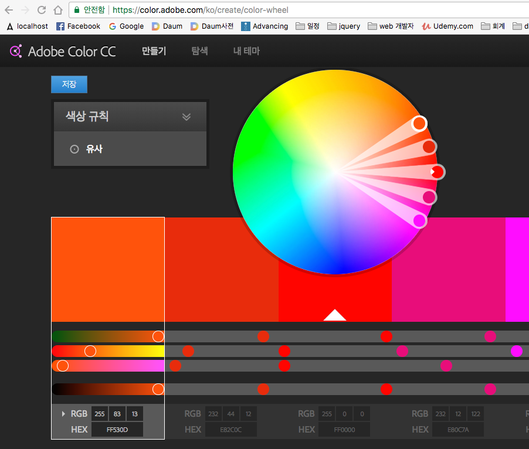
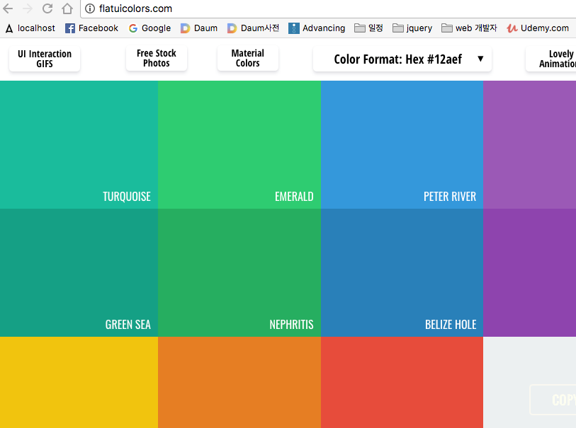
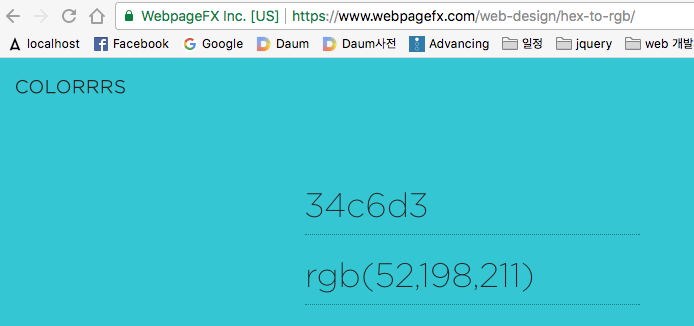
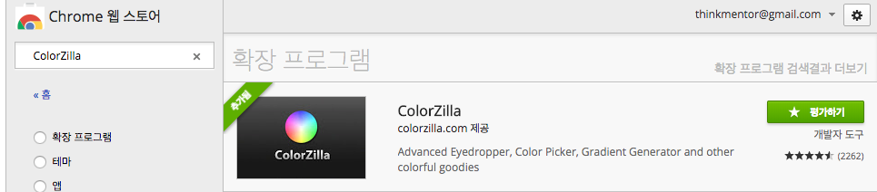
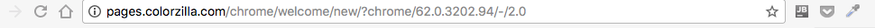

## structure 
- source/
    - index.html
    - css 폴더
        - style.css
    - js 폴더
        - custom.js 
    - img 폴더 
        - 이미지 복사 
        - img.zip 
        
## index.html 생성 
    - ./css/style.css 연동 
    - \</body> 위에 ./js/custom.js 연동

~~~
<!DOCTYPE html>
<html lang="en">
<head>
    <meta charset="UTF-8">
    <title>Title</title>
    <link rel="stylesheet" type="text/css" href="./css/style.css">
</head>
<body>

</body>
</html>
~~~   

## HTML 구조 
1. \<!DOCTYPE html>
    - 문서 타입  
    - 가장 최신의 웹표준을 지원하는 html5
2. html 시작 
    - \<html>
        - \<html lang="en">
        - 언어는 영어가 기본  
    - \</html>
3. head
    - \<head>
    \</head>    
4. body
    - \<body>
    - \</body>  
5. body 안에 
    - \<h1>Wecome to Homepage\</h1>   
~~~
<body>
<h1>Wecome to Homepage</h1>
~~~   

6. 메타태그
    - 메타태그는 페이지를 렌더링하는 방벙을 브라우저에게 알려준다  
    - \<meta charset="UTF-8">
        - 문자들을 utf-8 문자 인코딩 방식으로 설정  
        - html 문서의 문자셋 
        - http://meaningone.tistory.com/191 
    - \<meta http-equiv="X-UA-Compatible" content="IE=edge">
        - IE문서 모드       
        - IE 브라우저에서 가장 최신버전의 표준모드를 선택하라 
    - \<meta name="viewport" content="width=device-wdith, initial-scale=1">
        - 뷰포트 meta 태그 : 콘텐츠를 디바이스의 폭에 맞추어서 렌더링하라 
~~~
<head>
    <meta charset="UTF-8">
    <meta http-equiv="X-UA-Compatible" content="IE=edge">
    <meta name="viewport" content="width=device-wdith, initial-scale=1">
    
    <title>Title</title>
    <link rel="stylesheet" type="text/css" href="./css/style.css">

</head>
~~~           
7. 타이틀 
    - \<title>Modern Responsive Website\</title>
8. favicon
    - \<link rel="shortcut icon" href="./img/favicon.ico">
    - 브라이저 타이틀에서 왼쪽에 나오는 아이콘 
    - 확장자 ico
    - favicon 만들기 
        - https://www.favicon-generator.org/
~~~
<head>
    <meta charset="UTF-8">
    <meta http-equiv="X-UA-Compatible" content="IE=edge">
    <meta name="viewport" content="width=device-wdith, initial-scale=1">
    <title>Modern Responsive Website</title>

    <!--favicon-->
    <link rel="shortcut icon" href="./img/favicon.ico">

    <!-- style css -->
    <link rel="stylesheet" type="text/css" href="./css/style.css">

</head>
~~~
    
 

9. css 추가 
    - \<link rel="stylesheet" type="text/css" href="./css/style.css">
    - cascading style sheet
        - cascade : 폭포, 직렬, 폭포가 되어 떨어지다     
~~~
<head>
    <meta charset="UTF-8">
    <meta http-equiv="X-UA-Compatible" content="IE=edge">
    <meta name="viewport" content="width=device-wdith, initial-scale=1">
    <title>Modern Responsive Website</title>
    <!--favicon-->
    <link rel="shortcut icon" href="./img/favicon.ico">

    <!-- style css -->
    <link rel="stylesheet" type="text/css" href="./css/style.css">

</head>
~~~

10. javascript 추가 
    - \</body> 위에 추가 
        - jQuery 를 연동시키기 위해서 
    - \
~~~
<body>
<h1>Wecome to Homepage</h1>

</body>
~~~    

## jQuery 
- jQuery is Javascript library
- google 검색 : jQuery 
- http://jquery.com/
    - Download 메뉴 선택 
        - 2/3 부분 아래로 other CDNS
            - Google CDN
                - 링크를 클릭하면 버전이 나옴
                - 3.x snippet:
                    - 복사
- javascript 파일 가장 위에 복사 
    - \
~~~
<body>
<h1>Wecome to Homepage</h1>

<!-- jQuery CDN -->

<!--custom javascript->

</body>
~~~

- jQuery 문서 
    - 설명 
        - 엘리먼트 (DOM)을 선택하는 강력한 방법 
        - 선택된 엘리먼트를 효율적이고 쉽게 제어할 수 있는 다양한 수단 제공
        - 자바스크립트 라이브러리  
    - jQuery.com
        - 메뉴 : API Documentation
            - api 리스트가 나온다
## 온라인 코딩 테스트 
- https://jsfiddle.net/

## Google Web Font
- https://fonts.google.com/
    - sorting : Popular 
        - Roboto Codensed
            - 해당 타이틀 클릭 
                - 오른쪽 위 SELECT THIS FONT
                    - import 
                        - \<link href="https://fonts.googleapis.com/css?family=Roboto+Condensed:300,300i,400,400i,700,700i" rel="stylesheet">
                    - specify in CSS
                        - font-family: 'Roboto Condensed', sans-serif;
                    - customize 
                        - Roboto Condensed 모두 클릭 후
                        - EMBED 클릭하면 모두 표시
                    - import 내용 복사 
- style.css 위에 복사해 넣음                     
~~~
<head>
    <meta charset="UTF-8">
    <meta http-equiv="X-UA-Compatible" content="IE=edge">
    <meta name="viewport" content="width=device-wdith, initial-scale=1">
    <title>Modern Responsive Website</title>
    <!--favicon-->
    <link rel="shortcut icon" href="./img/favicon.ico">

    <!-- google web font -->
    <link href="https://fonts.googleapis.com/css?family=Roboto+Condensed:300,300i,400,400i,700,700i" rel="stylesheet">
    
    <!-- style css -->
    <link rel="stylesheet" type="text/css" href="./css/style.css">

</head>
~~~  

- /css/style.css
    - body { font-family: 'Roboto Condensed', sans-serif; }
    - 이 후에 브라우저를 새로 고침하면 폰트가 바뀐다 
~~~
/*========================================
        DEFAULT VALUES :

        Font Family : Robo Condensed
======================================== */

body {
    font-family: 'Roboto Condensed', sans-serif;
}
~~~   

## Color 
- https://coolors.co/
    - generate 메뉴 
    - explore 메뉴 
    

    
 
    
- http://www.color-blindness.com/color-name-hue/

 

- /css/style.css
    - 프로젝트 사이트 컬러 기준 
        - Greenish Blue   : #34c6d3   (Buttons, Icons, Links & Backgrounds
        - Steel Gray      : #41464b   (Headings)
        - Blue Bayoux     : #64707b   (Paragraphs)
        - White           : #fff      (Text With Black Backgrounds)
        - Black           : #000
~~~
/*========================================
        DEFAULT VALUES :

        Font Family : Robo Condensed

        Greenish Blue   : #34c6d3   (Buttons, Icons, Links & Backgrounds
        Steel Gray      : #41464b   (Headings)
        Blue Bayoux     : #64707b   (Paragraphs)
        White           : #fff      (Text With Black Backgrounds)
        Black           : #000
======================================== */

body {
    font-family: 'Roboto Condensed', sans-serif;
}
~~~     

 

- Adobe color wheel
    - https://color.adobe.com/ko/create/color-wheel

 

- http://flatuicolors.com/  

            
        
 
        
- 헥사(16진수)값을 RGB 변환 
    - http://www.webpagefx.com/web-design/hex-to-rgb
    
    

 

- ColorZilla
    - 크롬 확장 프로그램 

 

- 크롬 브라우저 오른쪽 
    - ColorZilla(스포이트) 
        - pick color from page 
    

 

## Font Awesome
- http://fontawesome.io/
    - 메뉴 : icons 클릭 
    - 첫번째 화면 
        - Download
            - No, thanks, just download Font Awesome 4
- 다운로드 이후 
    - /css/
        - /font-awesome/ 으로 바꾼 다음에 복사해 넣기       
- /index.html
    - 추가 
        - \<link rel="stylesheet" href="./css/font-awesome/css/font-awesome.min.css"> 
~~~
<head>
    <meta charset="UTF-8">
    <meta http-equiv="X-UA-Compatible" content="IE=edge">
    <meta name="viewport" content="width=device-wdith, initial-scale=1">
    <title>Modern Responsive Website</title>
    <!--favicon-->
    <link rel="shortcut icon" href="./img/favicon.ico">

    <!-- google web font -->
    <link href="https://fonts.googleapis.com/css?family=Roboto+Condensed:300,300i,400,400i,700,700i" rel="stylesheet">

    <!-- fontawesome-->
    <link rel="stylesheet" href="./css/font-awesome/css/font-awesome.min.css">
    <!-- style css -->
    <link rel="stylesheet" type="text/css" href="./css/style.css">

</head>
~~~        

- \<body> 에 테스트 
    - 추가 : <i class="fa fa-laptop"></i>
~~~
<body>
<h1>Wecome to Homepage</h1>

<i class="fa fa-laptop fa-2x"></i>
~~~             

- 2배, 5배 크기 desptop 아이콘 
    - fa-2x
        - \<i class="fa fa-laptop fa-2x">\</i> 
    - fa-5x
        - \<i class="fa fa-laptop fa-5x">\</i> 
          
~~~
<i class="fa fa-laptop"></i>
<i class="fa fa-laptop fa-2x"></i>
<i class="fa fa-laptop fa-5x"></i>
~~~

 

## Bootstrap 
- http://getbootstrap.com/
    - 기초개념 : bootstrap 
        - 부트스트랩(Bootstrap)이란, 일반적으로 한 번 시작되면 알아서 진행되는 일련의 과정을 뜻한다.
            - 컴퓨터 부팅 과정
    - 설명 
        - 트위터 개발자가 정형화된 인터페이스 
        - CSS와 Javascript 로 이루어진 라이브러리 
        - 반응형 웹을 쉽게 제작가능 
    - Download
        - Bootstrap CDN
            -  copy 클릭 /index.html 
                - custom.css 위에 
                    - <link rel="stylesheet" href="https://maxcdn.bootstrapcdn.com/bootstrap/4.0.0-beta
                .2/css/bootstrap
                .min.css" >
                - \</body>의 jQuery 다음에, jQuery 의존성  
                    - 
~~~
<head>
    <meta charset="UTF-8">
    <meta http-equiv="X-UA-Compatible" content="IE=edge">
    <meta name="viewport" content="width=device-wdith, initial-scale=1">
    <title>Modern Responsive Website</title>
    <!--favicon-->
    <link rel="shortcut icon" href="./img/favicon.ico">

    <!-- google web font -->
    <link href="https://fonts.googleapis.com/css?family=Roboto+Condensed:300,300i,400,400i,700,700i" rel="stylesheet">

    <!-- fontawesome-->
    <link rel="stylesheet" href="./css/font-awesome/css/font-awesome.min.css">

    <!-- bootstrap css -->
    <link rel="stylesheet" href="https://maxcdn.bootstrapcdn.com/bootstrap/4.0.0-beta.2/css/bootstrap.min.css" >

    <!-- style css -->
    <link rel="stylesheet" type="text/css" href="./css/style.css">

</head>

....
~~~
~~~
....

<!-- jQuery CDN -->

<!-- bootstrap javascript -->

<!--custom javascript-->

</body>
~~~
                    

    
    

 
                          
                        
        
           
    
          
         
  
        
    