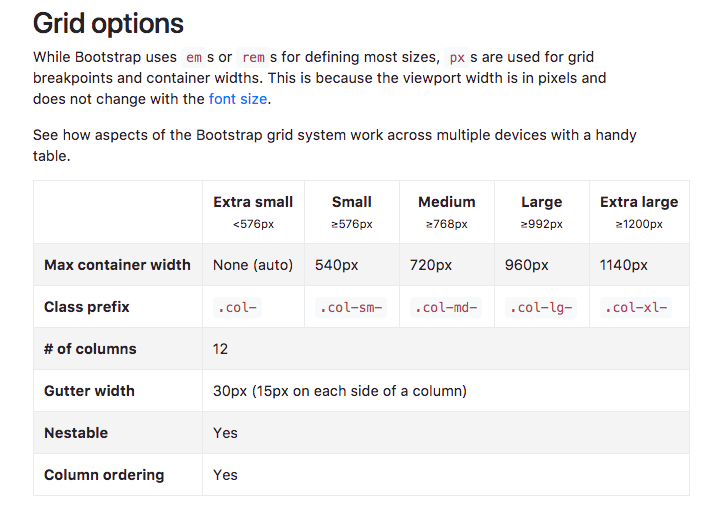
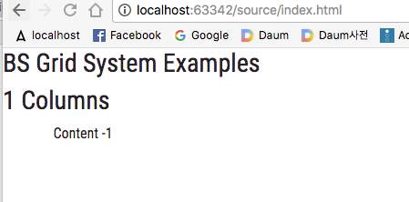
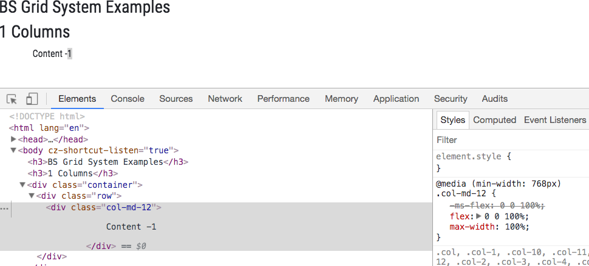
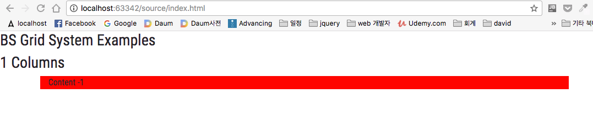
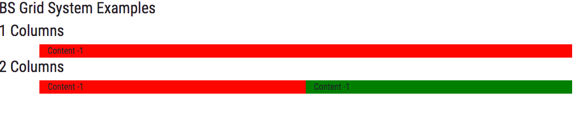
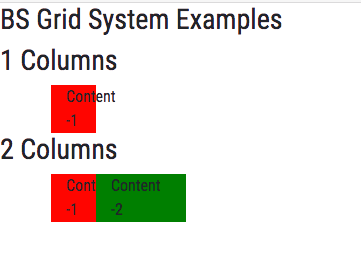
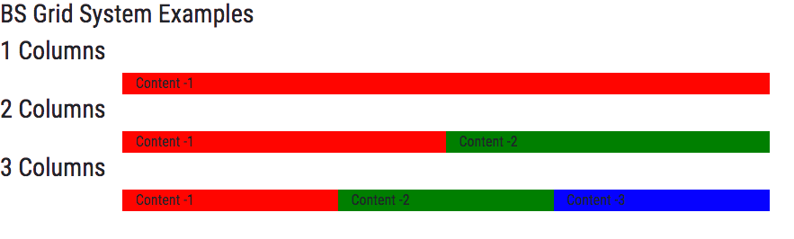
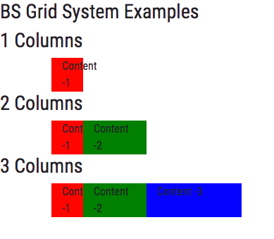
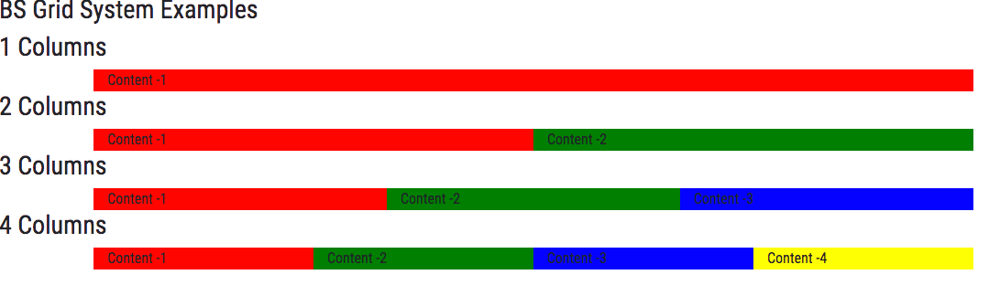
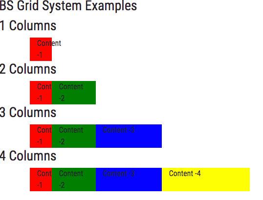

## Bootstrap Grid 
- 쉽고 편안하게 웹페이지의 레이아웃을 잡을 수 있다 

 

- 처음 시작 
    - Get started
        - Introduction
        - Layout 

## Grid System
- 기본적으로 : 12 Columns   

~~~
$grid-columns:      12;
$grid-gutter-width: 30px;

$grid-breakpoints: (
  // Extra small screen / phone
  xs: 0,
  // Small screen / phone
  sm: 576px,
  // Medium screen / tablet
  md: 768px,
  // Large screen / desktop
  lg: 992px,
  // Extra large screen / wide desktop
  xl: 1200px
);

$container-max-widths: (
  sm: 540px,
  md: 720px,
  lg: 960px,
  xl: 1140px
);
~~~
~~~
// Extra small devices (portrait phones, less than 576px)
@media (max-width: 575px) { ... }

// Small devices (landscape phones, 576px and up)
@media (min-width: 576px) and (max-width: 767px) { ... }

// Medium devices (tablets, 768px and up)
@media (min-width: 768px) and (max-width: 991px) { ... }

// Large devices (desktops, 992px and up)
@media (min-width: 992px) and (max-width: 1199px) { ... }

// Extra large devices (large desktops, 1200px and up)
@media (min-width: 1200px) { ... }
~~~

## Grid System - Made Up of 3 Things 
1. Container
2. Row(s)
3. Columns 
~~~

  

    

      One of three columns
    

    

      One of three columns
    

    

      One of three columns
    

  

~~~

## origin.html 
- index.html 에서 복사해서 그대로 원본을 남겨둠 

## Grid System Sample 
- /index.html
    - container
        - row 
            - col-md-12
                - 태블릿, max-width: 991px 
                - 전체 1줄 통째로 12개의 컬럼으로 구성 
~~~
<body>

<h3>BS Grid System Examples</h3>

<h3>1 Columns</h3>

    

        

            Content -1
            
        

    

~~~

 

- 검사(inspect)
    - 브라우저에서 오른쪽 마우스에서 "검사" 클릭 
    - col-md-12
        - min-width : 768px  

 

- /css/style.css
    - background 색깔을 grid 를 통해서 보기 위해서 , 아래를 추가 
        - .col-1
        - .col-2
        - .col-3
        - .col-4 
~~~
body { ...}

/* CSS - Jost for Grid Example */
.col-1 {
    background-color: red;
}
.col-2 {
    background-color: green;
}
.col-3 {
    background-color: blue;
}
.col-4 {
    background-color: yellow;
}
~~~
- /index.html
    - 클래스 : col-1 추가 
~~~

    

        

            Content -1
        

    

~~~

- 결과 

 

- /index.html
    - 새롭게 container 생성 
    - 클래스 : col-2 확인 
~~~
<h3>1 Columns</h3>

    

        

            Content -1
        

    

<h3>2 Columns</h3>

    

        

            Content -1
        

        

            Content -1
        

    

~~~    

 

 

- 브라우저 크기를 줄이면 
    - md 크기보다 작으면 
        - col-1 : 1개 크기 
        - col-2 : 2개 크기 

 

- /index.html
    - container 추가 
        - col-3 추가 
~~~
<h3>1 Columns</h3>

    

        

            Content -1
        

    

<h3>2 Columns</h3>

    

        

            Content -1
        

        

            Content -2
        

    

<h3>3 Columns</h3>

    

        

            Content -1
        

        

            Content -2
        

        

            Content -3
        

    

~~~    

 

- md 보다 클 경우 일정 

- md 보다 작을 경우 
    - col-1 : 1개 크기 
    - col-2 : 2개 크기 
    - col-3 : 3개 크기 
    

 

- /index.html
    - 아래 코드 추가 
~~~
<h3>4 Columns</h3>

    

        

            Content -1
        

        

            Content -2
        

        

            Content -3
        

        

            Content -4
        

    

~~~   

- col-md-3 : 3개씩 해서 12개 

- col-1, col-2, col-3, col-4 
    - 크기가 md 보다 작아지면 변동 
    
 

 

## 테스트 끝내고 
- /css/style.css 의 
~~~
body {
    font-family: 'Roboto Condensed', sans-serif;
}

/* CSS - Jost for Grid Example */
.col-1 {
    background-color: red;
}
.col-2 {
    background-color: green;
}
.col-3 {
    background-color: blue;
}
.col-4 {
    background-color: yellow;
}
~~~

- col 삭제나 주석처리  
    - .col-1 : 1개 크기 
    - .col-2 : 2개 크기 
    - .col-3 : 3개 크기
~~~
body {
    font-family: 'Roboto Condensed', sans-serif;
}

/* CSS - Jost for Grid Example */
/*
.col-1 {
    background-color: red;
}
.col-2 {
    background-color: green;
}
.col-3 {
    background-color: blue;
}
.col-4 {
    background-color: yellow;
}
*/
~~~

 

- /index.html
    - grid 테스트 주석처리 나 삭제 
~~~
<body>
<!--
<h3>BS Grid System Examples</h3>

<h3>1 Columns</h3>

    

        

            Content -1
        

    

<h3>2 Columns</h3>

    

        

            Content -1
        

        

            Content -2
        

    

<h3>3 Columns</h3>

    

        

            Content -1
        

        

            Content -2
        

        

            Content -3
        

    

<h3>4 Columns</h3>

    

        

            Content -1
        

        

            Content -2
        

        

            Content -3
        

        

            Content -4
        

    

-->
~~~            
    

       
