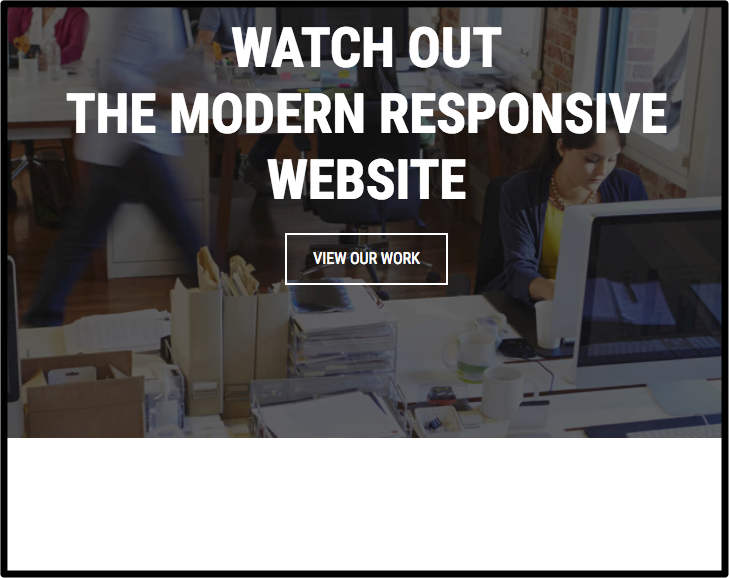

## Home Section 

- index.html 
    - home 생성 
        - \#home
            - \#home-cover
~~~
<body>
<!-- Home -->
<section id="home">
    

        
    

</section>
~~~   

 

- \#home-content-box
    - \#home-content-box-inner
~~~
<!-- Home -->
<section id="home">
    

        

            

                
            

        

    

</section>
~~~ 

 

- \#home-heading
    - \<h3>Watch Out\  The Modern Responsive Website\</h3>
~~~
<!-- Home -->
<section id="home">
    

        

            

                

                    <h3>Watch Out  The Modern Responsive Website</h3>
                

            

        

    

</section>
~~~

- \#home-heading 밑에 
- \#home-btn
    - <a class="btn btn-outline-primary btn-lg" href="#work" role="button"
        - getbootstrap/Documentation/Components/Buttons
            - btn-outline-primary : 겉에 테두리만 나타남
            - btn-lg : large  
            - class 에 btn-primary 하면 버튼 모양이 나타남  
            
~~~
<!-- Home -->
<section id="home">
    

        

            

                

                    <h3>Watch Out  The Modern Responsive Website</h3>
                

                

                    <a class="btn btn-outline-primary btn-lg" href="#work" role="button" title="View Our Work">View Our
                        Work</a>

                

            

        

    

</section>               
~~~        

 

----

## Home CSS
- /css/style.css
    - body 밑에 home 주석 기호 넣음 
~~~
/* General CSS */
body {
    font-family: 'Roboto Condensed', sans-serif;
}

/*========================================
                Home
======================================== */
~~~

- \#home-cover 에 
    - 이미지 넣기 ../img/bg-home.jpg 
~~~
/*========================================
                Home
======================================== */
#home-cover {
    background-image: url("../img/bg-home.jpg");
}
~~~

- \#home-cover 에
    - height: 100%; 넣기 
~~~
#home-cover {
    height: 100%;
    background-image: url("../img/bg-home.jpg");
}
~~~

- \#home-hover 위에 
- \#home 
    - height:100% 추가 
~~~
/*========================================
                Home
======================================== */
#home {
    height: 100%;
}
#home-cover {
    height: 100%;
    background-image: url("../img/bg-home.jpg");
}
~~~

 

- body 위에 
    - html, body 높이를 100% 로 설정하면 전체 그림이 나타남 
~~~
/* General CSS */
html, body {
    height: 100%;
}
body {
    font-family: 'Roboto Condensed', sans-serif;
}
~~~    

- \#home-cover 의 추가 
    - background-repeat: no-repeat; 이미지 반복 안함 
    - background-size: cover; 전체 크기 지정 
    - background-position: center; 위치는 중앙
~~~
#home-cover {
    height: 100%;
    background-image: url("../img/bg-home.jpg");
    background-repeat: no-repeat;
    background-size: cover;
    background-position: center;
}
~~~

 

----

- \#home-cover { ...} 아래에 
- \#home-content-box 시작 
    - width: 100%;  폭 좌우로 전체 
    - height: 100%; 폭 높이 전체 
    - display:table ; 보여주는 것을 테이블 처럼 
~~~
#home-cover {
    height: 100%;
    background-image: url("../img/bg-home.jpg");
    background-repeat: no-repeat;
    background-size: cover;
    background-position: center;
}
#home-content-box{
    width: 100%;
    height: 100%;
    display:table ;
}
~~~    

- #home-content-box{...} 아래 
- #home-content-box-inner { 시작 
    - display: table-cell; 
        - td 처럼 cell을 만든다
        - 중앙에 배치
    - vertical-align: middle;  위아래 중앙에 
    - background-color:green ; 박스 크기 확인용으로
    - text-align: center; 글자 중앙에 
        - /getbootstrap/Documentation/Utilities/Text
            - \
 에 텍스트의 align 설정 클래스
~~~
#home-content-box {...}
#home-content-box-inner{
    display: table-cell;
    vertical-align: middle;
    background-color:green ;
    text-align: center;
}
~~~   

- #home-content-box-inner {
    - text-align:center 를 주석처리 
    - background-color:green ; 삭제 
~~~
#home-content-box-inner{
    display: table-cell;
    vertical-align: middle;
    background-color:green ;
    /*text-align: center;*/
}
~~~       

- /index.html
    - 
 
        - 클래스 추가 : class="text-center"
            - bootstrap 방식으로 가운데 텍스트가 위치하게 만든다 
~~~

~~~        

- #home-content-box-inner{ 아래 설정 
- #home-heading h3 {
    - id 의 home-heading 의 태그 h3 를 설정
        - color :#fff ; 색깔을 흰색 
        - font-size:55px; 크기 
        - font-weight: 700;
            - google web font 의 지정중에 700 이 존재
        - margin : 20px 0 20px 0; 시계방향 = 위 오른쪽 아래 왼쪽 순서로
        - text-transform: uppercase; 형태변환 대문자로            
~~~
#home-content-box-inner{....}
#home-heading h3 {
    color :#fff ;
    font-size:55px;
    font-weight: 700;
    margin : 20px 0 20px 0;
    text-transform: uppercase;
}
~~~ 

 

- #home-heading h3 { 에서 
    - text-transform: uppercase; 제외하고 
~~~
#home-heading h3 {
    color :#fff ;
    font-size:55px;
    font-weight: 700;
    margin : 20px 0 20px 0;
}
~~~
    
- body 아래에 
- \<h3> 기본 대문자로 표시 
~~~
body {
    font-family: 'Roboto Condensed', sans-serif;
}
h3 {
    text-transform: uppercase;
}
~~~

 

---

## Home Button 수정 

- 버튼 View Our Work 에서 
    - 브라우저 오른쪽 버튼에서 검사를 클릭해서
        - 버튼에 대한 CSS 확인 

 

- /css/style.css 에서 맨 밑에 
    - button 주석 처리
    - 클래스 .btn-general { 와 
    - 클래스 .btn-white { 를 만든다  
~~~
/*========================================
                Button (Generic)
======================================== */
.btn-general {

}
.btn-white {
    
}
~~~       

- /index.html 에 
    - id= home-btn
        - 클래스 \<a class="btn btn-lg btn-general btn-white" href="#work" role="button" title="View Our Work">
            - 삭제 : btn-outline-primary
            - 추가 
                - btn-general
                - btn-white
~~~
    

        <a class="btn btn-lg btn-general btn-white" href="#work" role="button" title="View Our Work">View
            Our
            Work</a>

    

~~~   

- 클래스 .btn-general 설정 
~~~
.btn-general {
    border-color: #fff;
    border-width: 2px;
    border-radius: 0;
    padding: 12px 26px 12px 26px;
    font-size: 16px;
    font-weight: 400;
    text-transform: uppercase;
}
~~~

- .btn-white 를 설정하기 위해
    - .btn-general 에서
        - border-color:#fff 를 제거하고 
            - .btn-white 에 복사한다 
                - 네모 둘레를 흰색  : border-color: #fff;
                - 버튼 글씨를 흰색 : color :#fff;
~~~
.btn-white {
    border-color: #fff;
    color :#fff;
}
~~~   

- 버튼에 마우스를 대었을 때 
    - 바탕이 흰색으로 변하고 
    - 글씨는 약간 검은색으로 
~~~
.btn-white:hover, .btn-white:focus {
    background-color: #fff;
    color : #41464b
}
~~~   

## home 아래 처리 
- /index.html
    - \<section id="home">...</section> 아래에 공간을 만들기 위해 
        - \ 를 태그를 많이 넣으면 아래에 빈 공간이 생김
        - 오른쪽 스크롤을 위아래로 이동하면, 바탕이미지까지 같이 이동해서 움직인다   

~~~
<section id="home">
...
</section>

<!-- temporary space -->
          
          
          
~~~          

 

- /css/style.css
    - \#home-cover { 에서 
        -  추가 : background-attachment: fixed; 
            - 오른쪽 스크롤바 움직여도, 바탕 이미지가 고정됨 
~~~
#home-cover {
    height: 100%;
    background-image: url("../img/bg-home.jpg");
    background-repeat: no-repeat;
    background-size: cover;
    background-position: center;
    background-attachment: fixed;
}
~~~

 

---

## Parallax Effect: 시차, 패럴랙스
- 백그라운드 그대로 고정시키기 

 

- /css/style.css 에서 
    - \#home-cover 에서 
        - background-repeat: no-repeat;
        - background-size: cover;
        - background-position: center;
        - background-attachment: fixed;
        - 를 따로 복사하여 
    
~~~
#home-cover {
    height: 100%;
    background-image: url("../img/bg-home.jpg");
    background-repeat: no-repeat;
    background-size: cover;
    background-position: center;
    background-attachment: fixed;
}
~~~
- 아래 처럼 처리 
~~~
#home-cover {
    height: 100%;
    background-image: url("../img/bg-home.jpg");
~~~ 
- button 주석위에 아래처럼 parallax 주석 만들기 
    - .bg-parallax 클래스를 만들어서 복사함 
~~~
/*========================================
                PARALLAX (Generic)
======================================== */
.bg-parallax {
    background-repeat: no-repeat;
    background-size: cover;
    background-position: center;
    background-attachment: fixed;
}

/*========================================
                Button (Generic)
======================================== */
~~~

- /index.html
    - id="home-cover" 에
        - 추가 : class="bg-parallax"
~~~
<section id="home">
    

~~~    

 

---

## Animation Effect

- https://daneden.github.io/animate.css/
    - 다양한 애니메이션 효과 
        - boundInLeft
        - boundIn 
        - boundOut
        - fadeIn
        - zoomIn
        - zoomOut
        - zoomOutDown

        
- github
    - https://github.com/daneden/animate.css
    
- https://daneden.github.io/animate.css/
    - 다운로드를 클릭하면 
        - animate.css 다운로드 한 이후에 
- /css/ 안에 
    - /animate/ 폴더를 만들고
        - animate.css 를 복사한다 
~~~
/css/
    /animate/
        animate.css
~~~

- /index.html 의 head 에 
    - style.css 위에 
    - animate.css 를 위치 
~~~
....

    <!-- bootstrap css -->
    <link rel="stylesheet" href="https://maxcdn.bootstrapcdn.com/bootstrap/4.0.0-beta.2/css/bootstrap.min.css" >

    <!-- animage css -->
    <link rel="stylesheet" href="./css/animate/animate.css">

    <!-- style css -->
    <link rel="stylesheet" type="text/css" href="./css/style.css">
~~~

- /index.html 
    - id="home-cover"
        - class="bg-parallax" 에 animated 를 추가
            - 새로고침하면 background 이미지가 애니메이션 된다
                - 테스트 : zoomOut, fadeIn  
~~~
<!-- Home -->
<section id="home">
    

....
~~~

- 전체 적용 
    - id="home-cover"
        -  class="bg-parallax animated fadeIn"
            - fadeIn
    - 

        - class="animated zoomIn"    
    - 

        - class="animated zoomIn"   
    
~~~
<!-- Home -->
<section id="home">
    

        

            

                

                    <h3>Watch Out  The Modern Responsive Website</h3>
                

                

                    <a class="btn btn-lg btn-general btn-white" href="#work" role="button" title="View Our Work">View
                        Our
                        Work</a>

                

            

        

    

</section>
~~~                             
            
- https://github.com/daneden/animate.css
    - Usage
~~~
#yourElement {
  -vendor-animation-duration: 3s;
  -vendor-animation-delay: 2s;
  -vendor-animation-iteration-count: infinite;
}
~~~

- /css/style.css 맨 밑에 
    - \#home-cover 
        - 애니메이션 속도 
~~~
/*========================================
                Animate
======================================== */
#home-cover {
    animation-delay: .1s;
    animation-duration: .5s;
}
~~~     
- home-heading 애니메이션 속도가 다르게 진행된다 
~~~
/*========================================
                Animate
======================================== */
#home-cover {
    animation-delay: .1s;
    animation-duration: .5s;
}
#home-heading {
    animation-delay: .5s;
    animation-duration: .5s;
}
~~~  

- home-btn 속도가 가장 느리게 진행 
~~~
#home-cover {
    animation-delay: .1s;
    animation-duration: .5s;
}
#home-heading {
    animation-delay: .5s;
    animation-duration: .5s;
}
#home-btn {
    animation-delay: 1s;
    animation-duration: .5s;
}
~~~

 

- animation-duration: .5s; 을 한꺼번에 정리 
~~~
/*========================================
                Animate
======================================== */
#home-cover,
#home-heading,
#home-btn {
    animation-duration: .5s;
}
#home-cover {
    animation-delay: .1s;
}
#home-heading {
    animation-delay: .5s;
}
#home-btn {
    animation-delay: 1s;
}
~~~
                    

    
