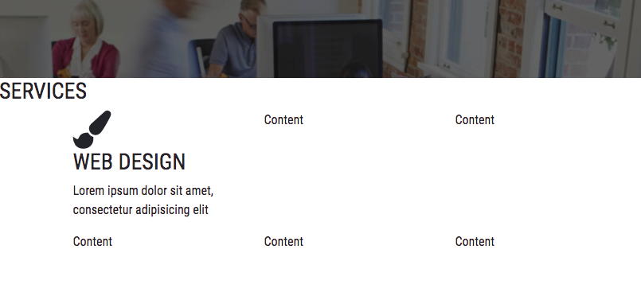
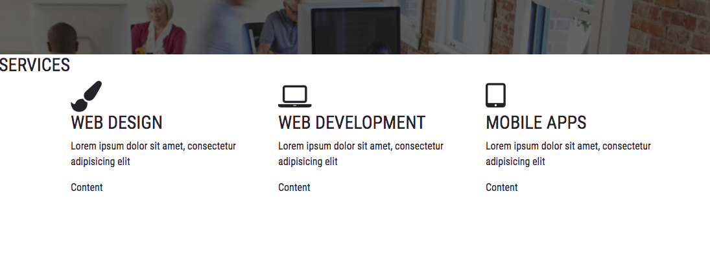
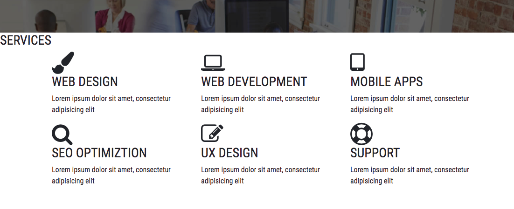

## Services Section 
-  temporary space 공간 위에 
    - 새로운 세셕 추가 
~~~
<!-- Home -->
<section id="home"> ...</home>

<!--services -->
<section id="services">
    
</section>

<!-- temporary space -->
          
          
          
~~~

- \
 추가 
~~~
<!--services -->
<section id="services">
    

        
    

</section>
~~~

- 추가 \

    - \<h3>
    - underline 
~~~
<!--services -->
<section id="services">
    

        

            <h3>Services</h3>
            

        

    

</section>
~~~

- 3개의 컬럼 만들기 
    - title 및에 container 만들기 
- container
    - row
        - col 
            - /getbootstrap/Documentation/Layout/Grid/
            - row 오버해서 쓸 경우 자동으로 내려감     
~~~
    

        <h3>Services</h3>
        

    

    

        

            
Content

            
Content

            
Content

            
Content

            
Content

            
Content

        

    

~~~     

- service container 안에 아이콘 넣기
    -  http://fontawesome.io/icons/
        - blush 검색 한 이후에 클릭하면 
            - \<i class="fa fa-paint-brush" >\</i>
~~~
    
  
        

            

                

                    

                        <i class="fa fa-paint-brush fa-3x"></i>
                    

                

            

            
Content

            
Content

            
Content

            
Content

            
Content

        

    

~~~   
- container 안의 개별 아이템 
    - icon 
    - title 
    - description : desc
        - [로렘 입숨](https://ko.wikipedia.org/wiki/%EB%A1%9C%EB%A0%98_%EC%9E%85%EC%88%A8)
~~~
    

        

            

                <i class="fa fa-paint-brush fa-3x"></i>
            

            

                <h3> Web Design</h3>
            

            

                
Lorem ipsum dolor sit amet, consectetur adipisicing elit

            

        

    

~~~

 

- 2번째 content 
    - icon : \<i class="fa fa-laptop fa-3x">\</i>
    - title : \<h3> Web Development\</h3>
~~~
    

        

            

                <i class="fa fa-laptop fa-3x"></i>
            

            

                <h3> Web Development</h3>
            

            

                
Lorem ipsum dolor sit amet, consectetur adipisicing elit

            

        

    

~~~

 

- 3번째 content 
    - tablet : \<i class="fa fa-tablet fa-3x">\</i>
    - \<h3> Mobile Apps\</h3>
~~~
    

        

            

                <i class="fa fa-tablet fa-3x"></i>
            

            

                <h3> Mobile Apps</h3>
            

            

                
Lorem ipsum dolor sit amet, consectetur adipisicing elit

            

        

    

~~~

 

- 4번째 content 
    - title \<i class="fa fa-search fa-3x">\</i>
    - \<h3> SEO Optimiztion\</h3> 
~~~
    

        

            

                <i class="fa fa-search fa-3x"></i>
            

            

                <h3> SEO Optimiztion</h3>
            

            

                
Lorem ipsum dolor sit amet, consectetur adipisicing elit

            

        

    

~~~

     

- 5번째 content 
    - title \<i class="fa fa-pencil-square-o fa-3x">\</i>
    - \<h3> UX Design\</h3>
~~~
    

        

            

                <i class="fa fa-pencil-square-o fa-3x"></i>
            

            

                <h3> UX Design</h3>
            

            

                
Lorem ipsum dolor sit amet, consectetur adipisicing elit

            

        

    

~~~    

 

- 6번째 content 
    - title \<i class="fa fa-life-ring fa-3x">\</i>
    - \<h3> Support\</h3>
~~~
    

        

            

                <i class="fa fa-life-ring fa-3x"></i>
            

            

                <h3> Support</h3>
            

            

                
Lorem ipsum dolor sit amet, consectetur adipisicing elit

            

        

    

~~~

 

## Services CSS
- class="content-box"
    - class="content-title"
        - class="content-title-underline"    
~~~
<!--services -->
<section id="services">
    

        

            <h3>Services</h3>
            

        

~~~

- /css/style.css 맨 아래에 
    - content 주석 추가 
~~~
....

#home-btn {
    animation-delay: 1s;
}

/*========================================
                Content (Generic)
======================================== */
.content-box {
    
}
~~~

 

- services 의 위, 아래를 60px 공간만들기
    - .content-box { 
~~~
.content-box {
    padding: 60px 0 60px 0 ;
}
~~~

- .content-box 아래에 
- .content-title h3 : 타이틀 
    - text-align: center; 글씨 중앙에 
    - margin:0 0 30px 0 ; 아래 부분만 공간 만들기 
~~~
.content-box { .... }
.content-title h3 {
    font-size: 30px;
    font-weight: 700;
    text-align: center;
    margin:0 0 30px 0 ;
}
~~~
- .content-title h3 아래에 
- .content-title-underline {
    - background-color:#34c6d3 ; Greenish Blue
    - margin: 0 auto 0 auto; 
        - 오른쪽마진 auto, 왼쪽마진 auto 하여 중앙에 위치 
        - 아래는 30px  
~~~
.content-title h3 {....}
.content-title-underline {
    width: 30px;
    height: 3px;
    background-color:#34c6d3 ;
    margin: 0 auto 30px auto;
}  
~~~~

 

---

## Container 안의 CSS
- /css/style.css 맨 아래에 
    - services 주석 추가 
~~~
.content-title-underline { ....}

/*========================================
                Services
======================================== */
.service-item{
    
}
~~~    

- .service_item 
    - padding: 20px 0 20px 0; : 위, 아래 공간을 만듬     
~~~
.service-item{
    padding: 20px 0 20px 0;
    margin-bottom: 20px;
    cursor: pointer;
}
~~~
- .service-item{....} 아래에 
- .service-item-icon i {
    - color : #34c6d3; Greenish Blue 
    - float: left ; 
        - 아이콘 바로 오른쪽으로 타이틀이 연달아 오게 하기 위해서
    - padding: 15px; 아이콘 공간 만들기  
~~~
.service-item{....}
.service-item-icon i {
    color : #34c6d3;
    float: left ;
    padding: 15px;
    margin-right: 25px ;
    width: 75px;
    height: 75px;
    text-align: center;
}
~~~    

- .service-item-icon i { ...} 다음에 
- .service-item:hover .service-item-icon i {
    - 마우스가 스쳐지나갈 때 아이콘 바탕색이 바뀌기 
~~~
.service-item-icon i { .... }
.service-item:hover .service-item-icon i {
    color:#fff;
    background-color: #34c6d3;
}
~~~

- .service-item:hover .service-item-icon i {...} 아래에 
- .service-item-title h3 : 타이틀 제목  
~~~
.service-item:hover .service-item-icon i {
    color:#fff;
    background-color: #34c6d3;
}
.service-item-title h3 {
    font-size:20px;
    font-weight: 200;
    margin: 0 0 10px 0 ;
}
~~~
- .service-item-title h3 { ...} 아래에 
- .service-item-desc p { : 설명 description

~~~
.service-item-title h3 {
    font-size:20px;
    font-weight: 200;
    margin: 0 0 10px 0 ;
}
.service-item-desc p {
    
}
~~~
 
- General 일부 수정 : 가장 윗 부분 
    - p : 추가 
        - color
        - font-size
        - font-weight
    - h3 : 일부 추가 
        - color:#41464b; steel gray 추가 
~~~
/* General CSS */
html, body {
    height: 100%;
}
body {
    font-family: 'Roboto Condensed', sans-serif;
}
p{
    color: #64707b;
    font-size: 16px;
    font-weight: 300;
}
h3 {
    color:#41464b;
    text-transform: uppercase;
}
~~~

 

---

## jQuery Animation 
- class="content-title
    - animated fadeInDown 추가 
~~~

~~~

- http://mynameismatthieu.com/WOW/
    - 메뉴 github
        - Clone or download 
            - Download ZIP
- 다운받은 파일에서 
    - WOW-master
        - dist
            - wow.min.js 를 복사 
~~~
- /js/
    - /wow/ 폴더 생성 
        - wow.min.js 복사    
~~~

 

- 문서 
    - http://mynameismatthieu.com/WOW/docs.html
- link to animate.css
~~~  
<link rel="stylesheet" href="css/animate.css">
~~~  

- link and activate WOW.js
~~~
  
  
~~~
- make an element 
~~~

    Content to Reveal Here

~~~

- animation style
~~~

    Content to Reveal Here

~~~ 
        
- advanced option 
~~~
<section class="wow slideInLeft" data-wow-duration="2s" data-wow-delay="5s">
</section>

<section class="wow slideInRight" data-wow-offset="10"  data-wow-iteration="10">
</section>
~~~
                                     
 

- /index.html
    - custom.js 위에
        - \
~~~
...

<!-- jQuery CDN -->

<!-- bootstrap javascript -->

<!-- WOW JS -->

<!--custom javascript-->

</body>
~~~ 

 

- /js/custom.js 에 추가 
    - $(document).ready(function () { 
        - 문서의 내용이 모두 실행되고 나서, 
        - jQuery 연결된 내용을 실행되게 하기 위해서
        - https://jquery.com/
            - API Documentation 
                - 검색창 : ready 검색
                    -  .ready() 찾아서 클릭 
                        - http://api.jquery.com/ready/                        
~~~
/*========================================
                Services
======================================== */
$(document).ready(function () {

});
~~~    
~~~
$(function() {
  // Handler for .ready() called.
});
~~~

- WOW 연결 
    - 스크롤 할 때 애니메이션 연동 
~~~
$(function() {
    //animate on scroll
    new WOW().init();

});
~~~

- /index.html
    - wow 추가 
    - animated 삭제 
        - 새로고침하고, 천천히 위로 올릴 때 애니메이션 가능 
~~~
<!--services -->
<section id="services">
    

        

            <h3>Services</h3>
            

        

~~~
- Advanced option 
    - 추가 : data-wow-duration="1s" 
    - 추가 : data-wow-delay=".5s"
    
~~~
<!--services -->
<section id="services">
    

        

            <h3>Services</h3>
            

        

~~~

 

- container
    - row 에 추가 : wow fadeInUp
    - data-wow-duration="1s" data-wow-delay=".5s" 
~~~
    

        

            

~~~
              
                     
        
    